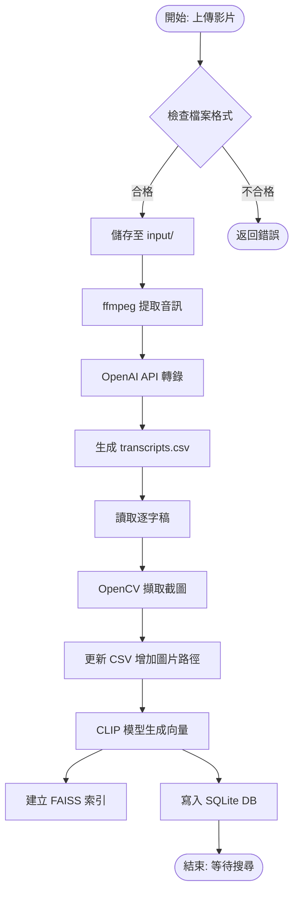
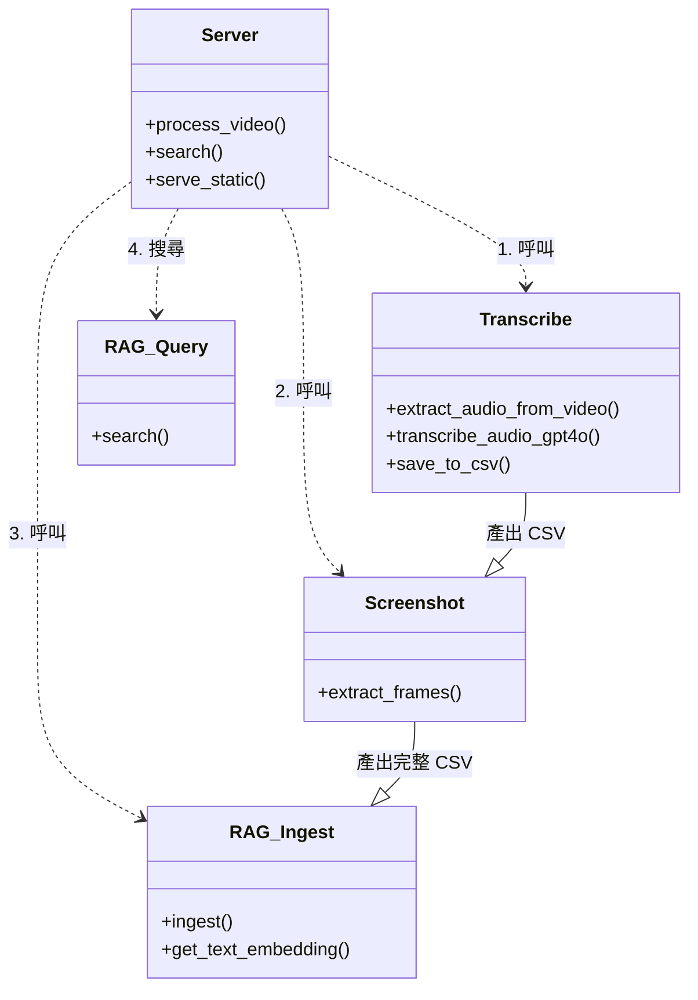

# 影片逐字稿理解系統

## 專案總覽 (Project Overview)
本專案為一套整合「影片內容理解」與「語意搜尋」的系統。使用者可上傳影片檔案，系統會自動進行語者分離逐字稿轉錄、關鍵畫面截圖，並建立 RAG (Retrieval-Augmented Generation) 向量資料庫。使用者後續可透過自然語言搜尋影片特定片段，系統將回傳對應的逐字稿、時間戳記以及該時間點的畫面截圖。

解決的問題：解決長影片難以快速檢索特定內容的痛點，透過語意搜尋取代傳統的關鍵字搜尋。
使用對象：需整理大量訪談、會議記錄或教學影片的使用者。
專案性質：Web Application (Service)

## 系統架構說明 (Architecture Overview)
本系統採用 Client-Server 架構。前端為單頁式應用 (SPA)，負責檔案上傳與搜尋介面展示；後端使用 Flask 框架作為 API 伺服器，並協調各個核心處理模組。資料流以檔案系統為基礎，透過 CSV 進行模組間的資料傳遞，最終整合至 SQLite 與 FAISS 向量索引中。

### 模組職責
- **Server (Flask):** 接收請求、協調背景任務、提供 API 介面。
- **Transcribe Module:** 負責影片音訊提取與呼叫 OpenAI GPT-4o API 進行轉錄。
- **Screenshot Module:** 依據轉錄的時間戳記，使用 OpenCV 擷取影片畫面。
- **RAG Module:** 使用 CLIP 模型將文字轉為向量，並建立 FAISS 索引與 SQLite Metadata 資料庫。

### 系統架構圖
```mermaid
graph TD
    User[使用者] -->|上傳影片/搜尋| Frontend[前端介面 (HTML/JS)]
    Frontend <-->|HTTP API| Backend[後端伺服器 (Flask)]
    
    subgraph "核心處理模組 (Core Modules)"
        Backend -->|1. 呼叫| Transcribe[轉錄模組 (transcribe.py)]
        Backend -->|2. 呼叫| Screenshot[截圖模組 (extract_screenshots.py)]
        Backend -->|3. 呼叫| RAG_Ingest[索引模組 (rag_ingest.py)]
        Backend -->|4. 查詢| RAG_Query[搜尋模組 (rag_query.py)]
    end
    
    subgraph "外部服務 & 模型 (External)"
        Transcribe -->|API Request| OpenAI[OpenAI GPT-4o API]
        RAG_Ingest -->|Load| CLIP[CLIP Model (Local)]
        RAG_Query -->|Load| CLIP
    end
    
    subgraph "資料存儲 (Storage)"
        Transcribe -->|Write| CSV[transcripts.csv]
        Screenshot -->|Update| CSV
        Screenshot -->|Save| Img[Images]
        RAG_Ingest -->|Read| CSV
        RAG_Ingest -->|Build| DB[(SQLite + FAISS)]
        RAG_Query -->|Query| DB
    end
```

## 系統流程說明 (System Flow)
系統運作主要分為「資料處理 (Ingestion)」與「搜尋 (Retrieval)」兩個階段。上傳影片後，系統會自動在背景執行處理流程。

### 主要執行流程
1. **上傳與音訊提取：** 接收影片，使用 ffmpeg 提取 m4a 音訊。
2. **逐字稿轉錄：** 將音訊送至 OpenAI GPT-4o-transcribe-diarize 模型，取得含時間戳記與語者標記的文字。
3. **畫面擷取：** 讀取轉錄結果，針對每一段對話的開始與結束時間進行截圖。
4. **向量建置：** 讀取最終 CSV，將文字內容通過 CLIP 模型轉為向量，存入 FAISS 索引，並將 Metadata 存入 SQLite。

### 處理流程圖


## 資料夾結構說明 (Folder Structure)

```text
/ (Root)
├── 1_逐字稿擷取/            # 轉錄模組目錄
│   ├── transcribe.py       # 核心轉錄邏輯，包含 ffmpeg 呼叫與 OpenAI API 串接
│   └── api_key.json        # OpenAI API 金鑰設定檔
├── 2_逐字稿圖片擷取/        # 截圖模組目錄
│   └── extract_screenshots.py # 讀取 CSV 並使用 OpenCV 截圖
├── 3_RAG_database/         # RAG 資料庫模組目錄
│   ├── rag_ingest.py       # 建立向量資料庫索引 (Ingestion)
│   └── rag_query.py        # 執行語意搜尋 (Retrieval)
├── 4_server/               # 後端伺服器目錄
│   ├── server.py           # Flask 主程式，定義 API Endpoint
│   └── requirements.txt    # Python 相依套件清單
├── 5_frontend/             # 前端靜態資源目錄
│   ├── index.html          # 主頁面結構
│   ├── app.js              # 前端邏輯 (API 呼叫、狀態輪詢)
│   └── styles.css          # 樣式表
├── input/                  # 影片輸入目錄 (使用者上傳暫存)
└── output/                 # 系統輸出目錄
    ├── screenshots/        # 存放所有截圖檔案
    ├── transcripts.csv     # 核心資料檔 (含文字、時間、圖片路徑)
    ├── rag_mm.db           # SQLite Metadata 資料庫
    └── transcript.index    # FAISS 向量索引檔
```

## 核心模組與重要檔案 (Key Modules & Files)

### 模組關係圖


- **server.py**: 整合中心，管理 `processing_status` 狀態，並依序動態載入執行 `transcribe`、`extract_screenshots` 與 `rag_ingest`。
- **transcribe.py**: 負責與 OpenAI 溝通。特點是實作了大型音訊檔案分割 (`split_audio`) 機制，避免超過 API 限制。
- **extract_screenshots.py**: 影格處理核心。讀取 CSV 後，計算毫秒級時間點，精準擷取對話開始與結束畫面。
- **rag_ingest.py**: 資料庫建置者。使用 `openai/clip-vit-base-patch32` 模型將文字向量化，這是搜尋功能的基礎。

## 安裝與環境需求 (Installation & Requirements)

### 系統需求
- 作業系統：Windows (程式碼中包含對 Windows 路徑與 ffmpeg 指令的特定處理)
- Python 版本：3.8+

### 外部工具
- **ffmpeg**: 必須安裝並加入系統 PATH 環境變數，用於音訊提取。

### Python 相依套件
請參閱 `4_server/requirements.txt`，主要包含：
- flask, flask-cors (Web Server)
- openai, requests (API Client)
- opencv-python (Image Processing)
- torch, transformers (AI Model)
- faiss-cpu (Vector Index)
- pillow (Image utility)

### 環境變數與設定
- **OpenAI API Key**: 必須設定於 `1_逐字稿擷取/api_key.json`。格式如下：
  ```json
  {
      "openai": {
          "api_key": "YOUR_API_KEY"
      }
  }
  ```

## 使用方式 (How to Use)

### 啟動系統
1. 開啟終端機，切換至 `4_server` 目錄。
2. 執行伺服器：
   ```bash
   python server.py
   ```
3. 伺服器將啟動於 `http://localhost:5000`。

### 操作流程
1. **開啟瀏覽器**：存取 `http://localhost:5000`。
2. **上傳影片**：點擊上傳按鈕選擇影片檔案。
3. **等待處理**：介面會顯示目前進度 (轉錄 -> 截圖 -> 建立索引)。
4. **搜尋內容**：處理完成後，於搜尋框輸入自然語言 (例如：「提到人工智慧的地方」)。
5. **檢視結果**：系統列出相關片段，包含文字與對應截圖。

## 設定說明 (Configuration)

- **API Key**: 修改 `1_逐字稿擷取/api_key.json`。
- **CLIP 模型**: 於 `rag_ingest.py` 與 `rag_query.py` 中定義 `CLIP_MODEL_NAME = "openai/clip-vit-base-patch32"`，可依需求更換 HuggingFace 模型。
- **搜尋結果數量**: 於 `rag_query.py` 中定義 `TOP_K = 5`，控制預設回傳筆數。
- **截圖解析度**: 依賴原始影片解析度，`extract_screenshots.py` 直接儲存原始影格。

## 開發者指南 (Developer Guide)

### 建議閱讀順序
1. `4_server/server.py`: 理解整體調度邏輯與 API 定義。
2. `1_逐字稿擷取/transcribe.py`: 理解如何處理音訊與串接 OpenAI。
3. `3_RAG_database/rag_ingest.py`: 理解向量資料庫的結構。

### 修改注意事項
- **路徑處理**: 專案大量使用相對路徑 (`Path(__file__).parent`) 定位跨目錄檔案，移動檔案時需特別注意路徑參照。
- **動態載入**: `server.py` 使用 `importlib` 動態載入模組，修改模組檔名需同步更新 server 程式碼。
- **Windows 相容性**: FAISS 在 Windows 寫入索引時有路徑編碼問題，程式碼中已包含 `os.chdir` 的 workaround，請勿移除。

## 已知限制與待辦事項 (Limitations & TODO)

### 限制 (Limitations)
- **檔案大小**: `transcribe.py` 內建分割邏輯處理超過 25MB 的音訊，但極大檔案可能導致處理時間過長。
- **單一執行緒**: `server.py` 使用全域 `processing_status` 變數且未實作 Job Queue，同一時間只能處理一個影片上傳任務。
- **ffmpeg 相依**: 必須預先手動安裝 ffmpeg，無自動安裝機制。

### 待辦事項 (TODO)
- 實作多人多工佇列 (Queue System)。
- 增加對更多影片格式的錯誤處理。
- 優化 CLIP 模型載入速度 (目前每次查詢或建立索引時皆重新載入模型)。

## 補充說明 (Notes)
- `output/` 資料夾中的 `transcripts.csv` 是系統的核心資料交換中心。若需手動修正逐字稿，可直接編輯此 CSV，但需確保格式正確，並重新執行 `rag_ingest.py` 以更新索引。
